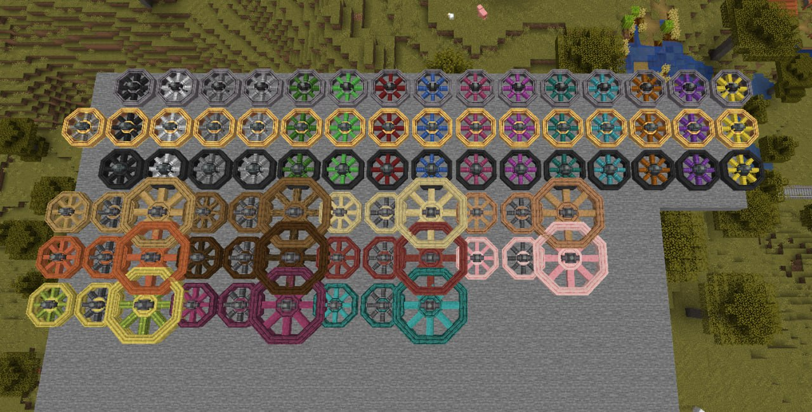
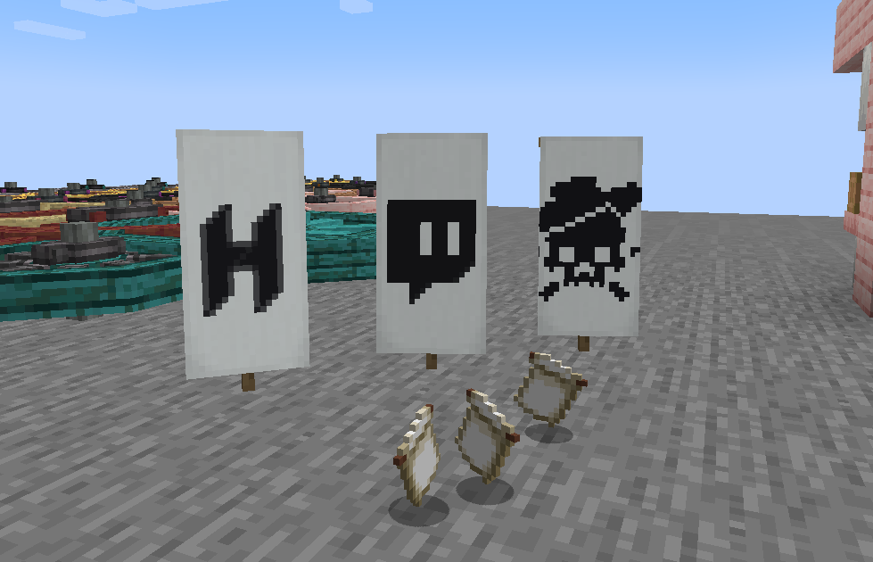

# Benvenuti nel nuovo menu!

Da qui, potrete vedere le ultime notizie del modpack, della mod e di tanto altro! Ricordate di fare la sub... ah no, se siete qui **Già la avete!**

[Qui](https://mod.hemerald.net/post/?i=31) trovate l'ultimo post con le novità della versione 2.2.0, ma presto troverete anche le notizie del nuovo aggiornamento in arrivo, la 2.3.0! Intanto ecco qui alcune informazioni:

> L'aggiornamento alla 1.20 è stato effettuato!
- Aggiunte le nuove flywheel! Con una marea di combinazioni diverse, le flywheel possono essere fatte ruotare con una shaft o anche **Mettendole su di un treno**!
- Aggiunto il contatore di energia, che ti dice per l'appunto quanta Forge Energy passa al tick
- In arrivo i 3 nuovi pattern per banner a tema hemerald!
Questo è tutto per oggi! Per qualsiasi problema, ricordate di andare sul [discord](https://discord.gg/hemerald)