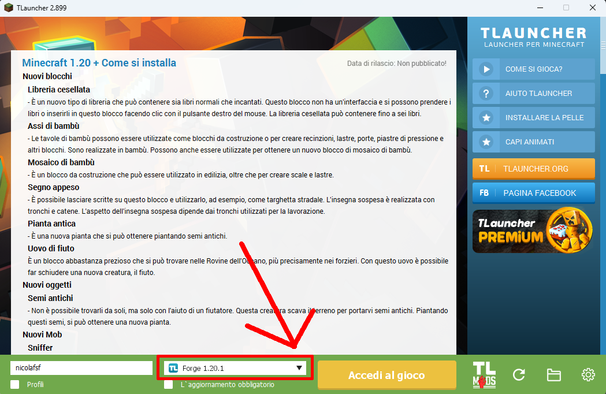
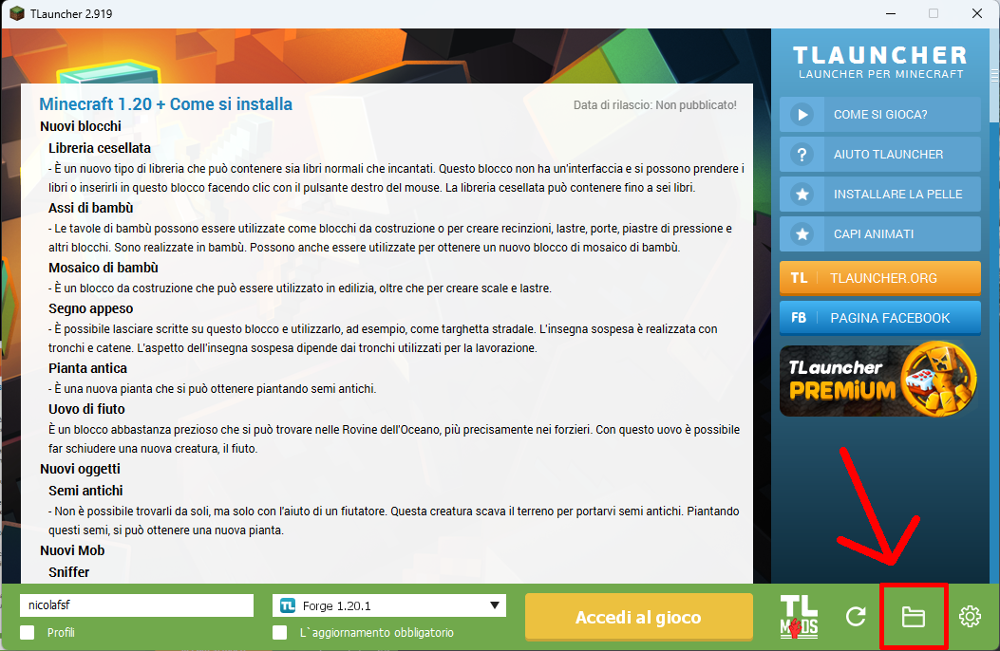

# 
Manuale di Installazione

Craccato

- Prima di tutto installa JAVA-JDK17: (Clicca qui sotto rispetto al tuo computer)

> [Windows](https://download.oracle.com/java/17/archive/jdk-17.0.10_windows-x64_bin.exe)
> [MacOS](https://download.oracle.com/java/17/archive/jdk-17.0.10_macos-x64_bin.dmg)

- Installa **[TLauncher](https://tlauncher.org/en/)** da internet
- Nel menu, clicca sulla freccia in basso e seleziona **Forge 1.20.1**, come mostrato nell'immagine

- A questo punto, premi in basso a destra sull'icona della cartella, per aprire i file di gioco.

- Ora, se esiste una cartella chiamata **mods**, e una chiamata **config**, eliminale
- Procedi scaricando quindi il pacchetto della CreateSubs dal [sito](https://mod.hemerald.net)
- Apri la zip della CreateSubs, entra nella cartella **.minecraft**, ed estrai le due cartelle **config** e **mods** dentro la cartella che hai aperto prima da TLauncher
- A questo punto puoi avviare minecraft! Ricorda che ti verrà chiesto di fare il login con twitch!