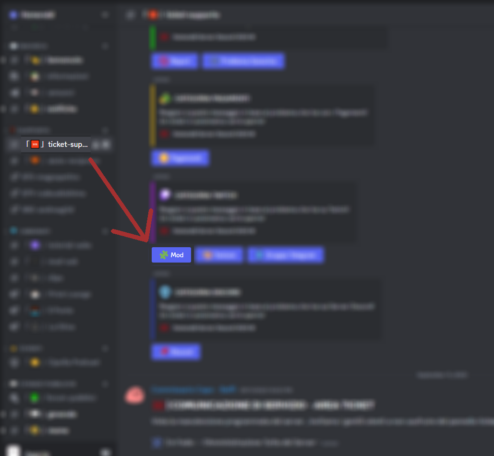

# Ticket
Per aprire un ticket sul discord, prima di tutto entra nel [Discord ufficiale di hemerald](https://discord.gg/hemerald)!
Successivamente vai nelle impostazioni di discord, clicca su **Connessioni** (O connections) e collega discord a twitch, in modo che potremo aiutarti ancora più velocemente!

Una volta fatto, apri un ticket con categoria mod sul discord di hemerald:

Ora fornisci le informazioni necessarie per essere aiutato. Se la mod é crashata, consulta [questo documento](https://mod.hemerald.net/wiki/support/Crash.md)